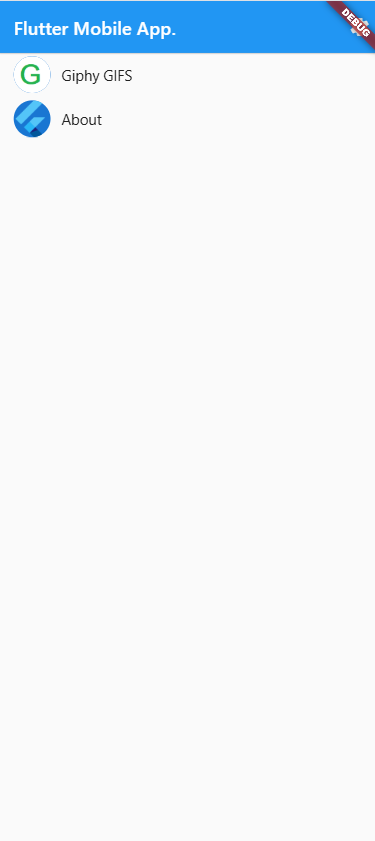
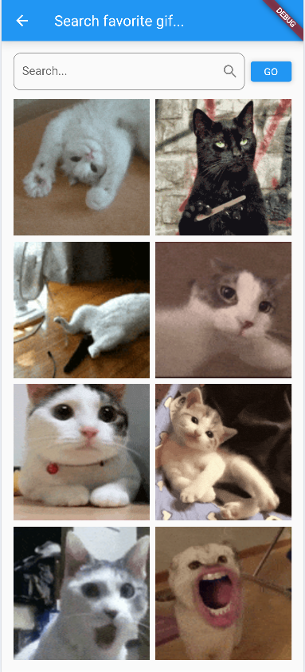
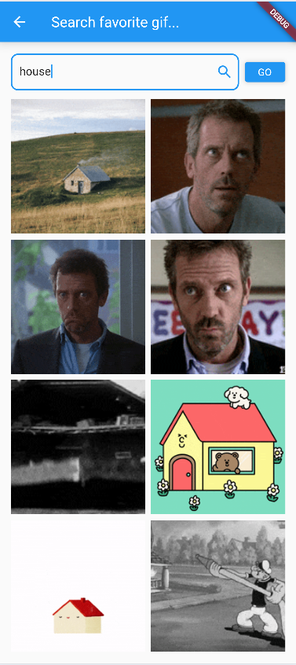
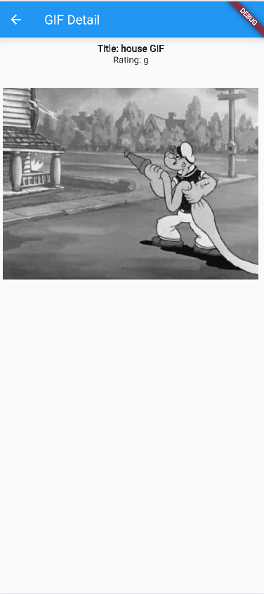

# A gif search application using the Giphy service

### dart: ">=2.18.4 <3.0.0"

### Flutter --version and tools

Flutter 3.3.8 • channel stable • https://github.com/flutter/flutter.git

Tools • Dart 2.18.4 • DevTools 2.15.0

### Screenshots

Home page

- Ability to go to Giphy app
- In right top corrner under `debug` text is settings button.

Default searchTerm text is set to 'cat'

Search your favorite gif by typing inside `TextField` and...

- Wait 3 seconds.
- Press GO.
- Or press enter.

You can click on one of gifs and detailed view will open:

- Title
- Raiting

It is possible to add more information in DetailsView for example:

- import_datetime
- trending_datetime

Full giphy api response class see here: flutter_giphy\lib\src\classes\giphy.dart

### RUN:

open terminal in root folder and type: `flutter run`

### Run TESTS!

#### To run all test enter 2 lines in `flutter_giphy` directory (using terminal)!

flutter test --plain-name "Plus Operator"

flutter test --plain-name "MyWidget"

# flutter_giphy

A new Flutter project.

## Getting Started

This project is a starting point for a Flutter application that follows the
[simple app state management
tutorial](https://flutter.dev/docs/development/data-and-backend/state-mgmt/simple).

For help getting started with Flutter development, view the
[online documentation](https://flutter.dev/docs), which offers tutorials,
samples, guidance on mobile development, and a full API reference.

## Assets

The `assets` directory houses images, fonts, and any other files you want to
include with your application.

The `assets/images` directory contains [resolution-aware
images](https://flutter.dev/docs/development/ui/assets-and-images#resolution-aware).

## Localization

This project generates localized messages based on arb files found in
the `lib/src/localization` directory.

To support additional languages, please visit the tutorial on
[Internationalizing Flutter
apps](https://flutter.dev/docs/development/accessibility-and-localization/internationalization)
